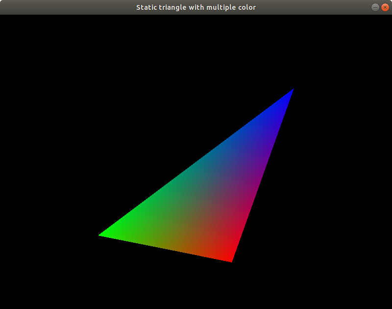

# Static triangle with multiple color

This application draws a triangle to the screen. The colors of the points are different, so that the color of the triangle isn't static. It uses a basic [fragment](./shaders/fragmentshader.frag) and a [vertex](./shaders/vertexshader.vert) shader.

The application could be started with a settings screen, where the color component of the item and the background color could be set.

How to run the application (if you are in the main directory):

- without settings:

```
go run examples/02-multiple-color-triangle/app.go
```



- with settings:

```
SETTINGS=on go run examples/02-multiple-color-triangle/app.go
```

In settings mode, the `escape` key displays the menu screen, where the main screen could be started / continued / restarted with the latest settings. The settings page and exit function also available from the menu screen.
