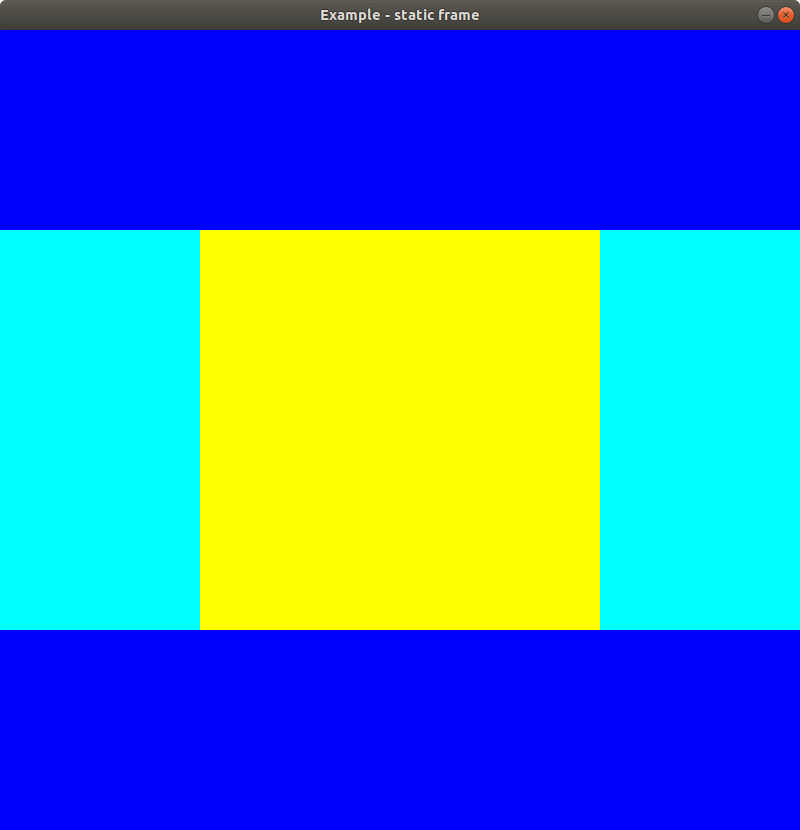
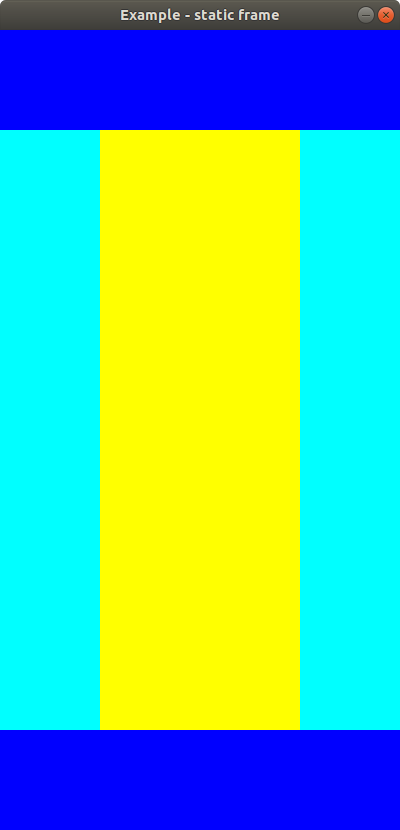
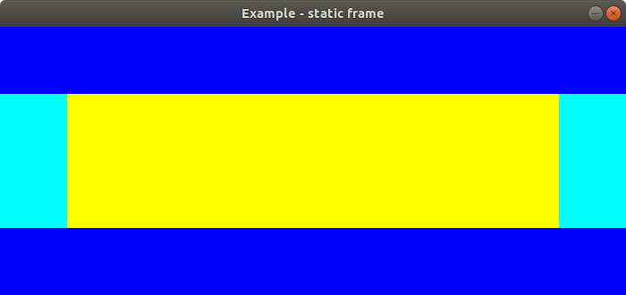
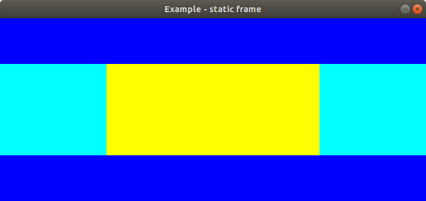

# Static frame app

The purpose of this app to draw a static frame to the screen. The frame has to be fine for every screen size.
The first iteration the following features were implemented:
- Env handling in the init function. the width and height of the window could be managed by setting the `WIDTH` and the `HEIGHT` envs.
- Default window size: 800 * 800.
- Shader applications for the sample app.

How to run the application (if you are in the main directory):

- without settings:

```
go run examples/02-static-frame/app.go
```



- with settings:

```
ASPECT=1 WIDTH=400 go run examples/02-static-frame/app.go
```



```
ASPECT=1 WIDTH=700 HEIGHT=300 go run examples/02-static-frame/app.go
```



```
WIDTH=700 HEIGHT=300 go run examples/02-static-frame/app.go
```


