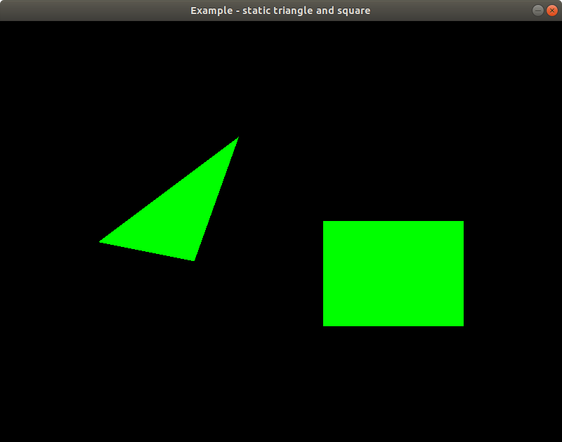

# Static triangle and square

This application draws a green square and a green triangle to the screen. It hasn't any mouse or keyboard control, just the image on the screen.


The application could be started with a settings screen, where the color, position, scale of the items and the background color could be set.

How to run the application (if you are in the main directory):

- without settings:

```
go run examples/02-static-multiple-objects/app.go
```


- with settings:

```
SETTINGS=on go run examples/02-static-multiple-objects/app.go
```

In settings mode, the `escape` key displays the menu screen, where the main screen could be started / continued / restarted with the latest settings. The settings page and exit function also available from the menu screen.
