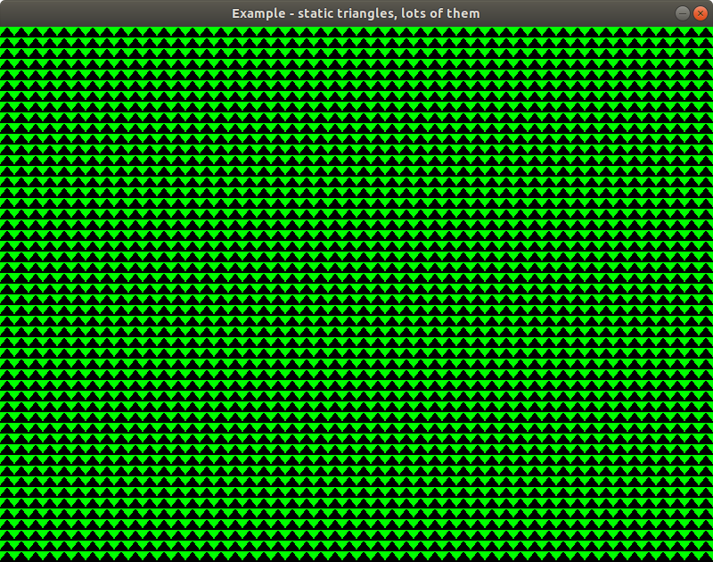

# Static triangles app

This application draws triangles to the screen. It hasn't any mouse or keyboard control, just the image on the screen.

The application could be started with a settings screen, where the triangle and the background colors, the row and the column number could be set.

How to run the application (if you are in the main directory):

- without settings:

```
go run examples/02-static-triangle/app.go
```



- with settings:

```
SETTINGS=on go run examples/02-static-triangle/app.go
```

In settings mode, the `escape` key displays the menu screen, where the main screen could be started / continued / restarted with the latest settings. The settings page and exit function also available from the menu screen.
