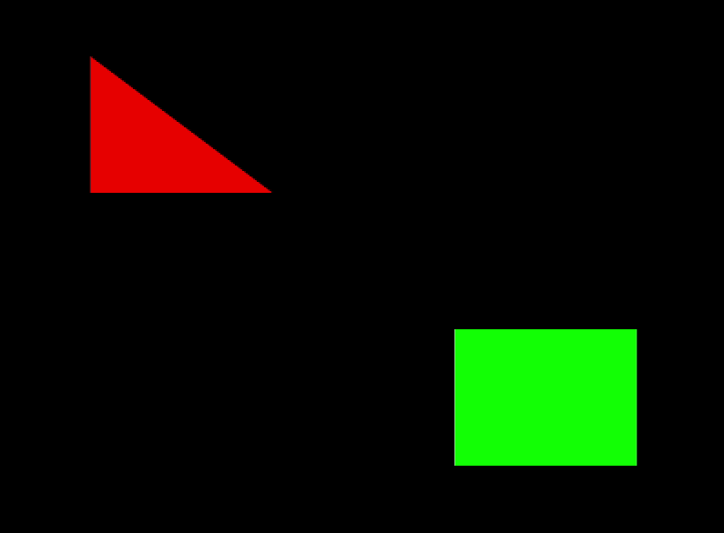

# Static button handler

This application draws a square and a triangle to the screen. The color of the shapes can be swapped with the `T` button. Until the button is pressed, the colors are swapped. The cube's position is changable. It goes forward with the `W`, backward with the `S`, left with the `A` and right with the `D` button. The triangle also changes it's position, it moves to the opposite directions.

## Controls

- **T** Swap colors
- **W** Move the square forward, the triangle backward direction.
- **S** Move the square backward, the triangle forward direction.
- **A** Move the square left, the triangle right direction.
- **D** Move the square right, the triangle left direction.

