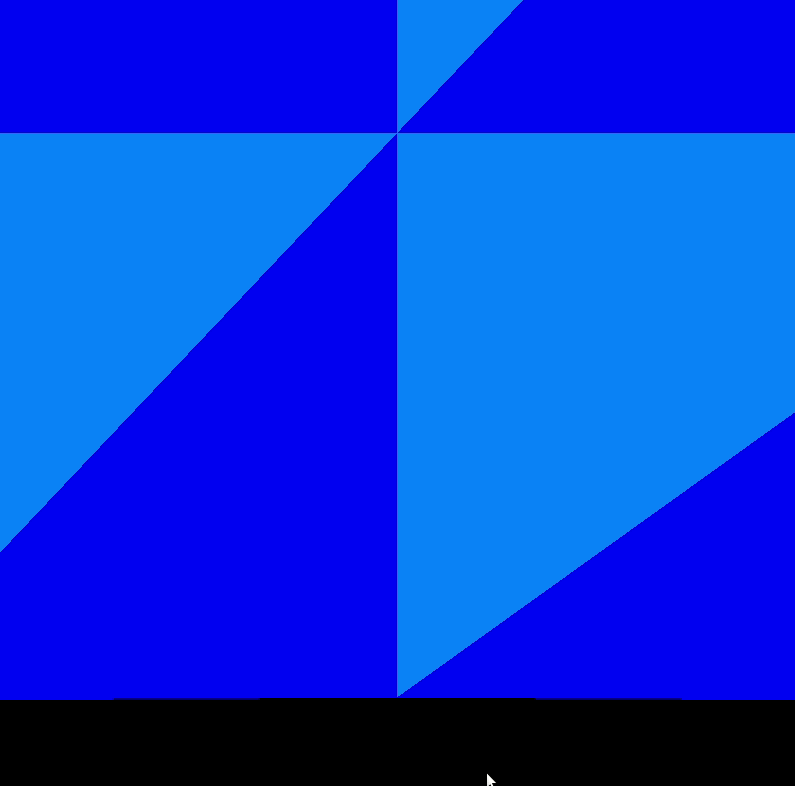

# Static Mesh deformer

Broken application... The mesh implementation eliminated the hack that i used here ot make the stuff deformed.

This application demonstrates the mesh deformer vertex shader. The movement is based on a periodic (sin) function in the [vertex shader](./vertexshader.vert). The camera movement is possible with the `W`, `Q`, `A`, `S`, `D`, `E` buttons and with the mouse.

