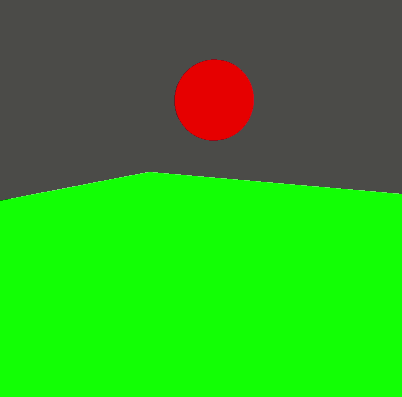

# Plane with a ball

This draws a green plane and a red bouncing ball to the screen. The camera is movable and rotatable with the `W`, `Q`, `A`, `S`, `D`, `E` keys and with the mouse.

The application could be started with a settings screen, where the color component of the items and the background color, and other details could be set.

How to run the application (if you are in the main directory):

- without settings:

```
go run examples/05-ball-with-camera/app.go
```

Ball with 10 as precision:


Ball with 100 as precision:



- with settings:

```
SETTINGS=on go run examples/05-ball-with-camera/app.go
```

In settings mode, the `escape` key displays the menu screen, where the main screen could be started / continued / restarted with the latest settings. The settings page and exit function also available from the menu screen.
