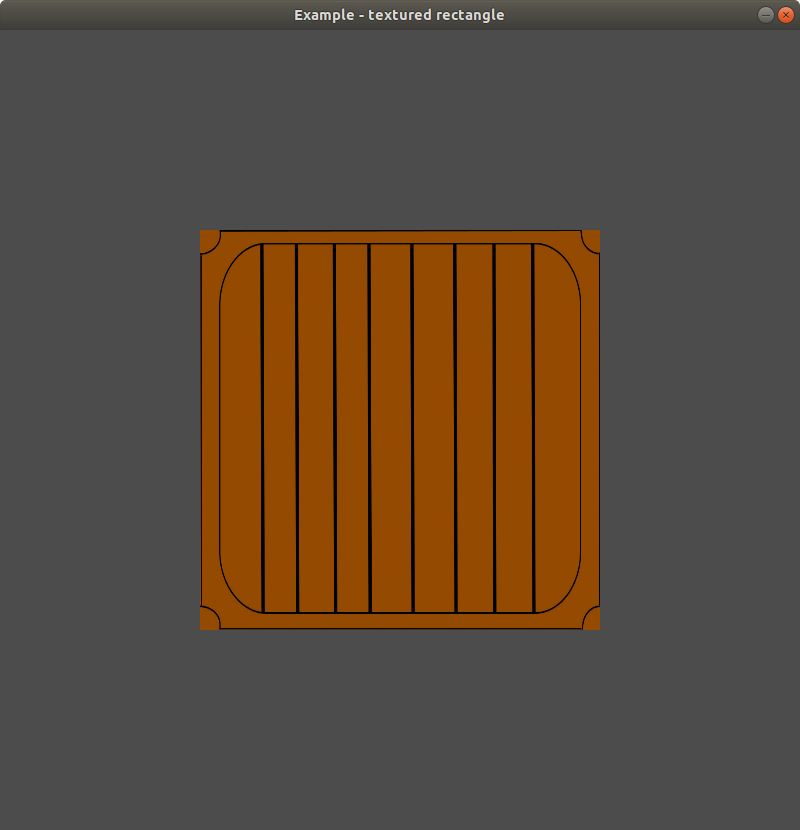

# Textured rectangle application

The purpose of this application is to play around with textured object. In this case with a texturex rectangle. We haven't got samera, so that we can't move around.

The application could be started with a settings screen, where the color component of the items and the background color could be set.

How to run the application (if you are in the main directory):

- without settings:

```
go run examples/07-textured-rectangle/app.go
```



- with settings:

```
SETTINGS=on go run examples/07-textured-rectangle/app.go
```

In settings mode, the `escape` key displays the menu screen, where the main screen could be started / continued / restarted with the latest settings. The settings page and exit function also available from the menu screen.
