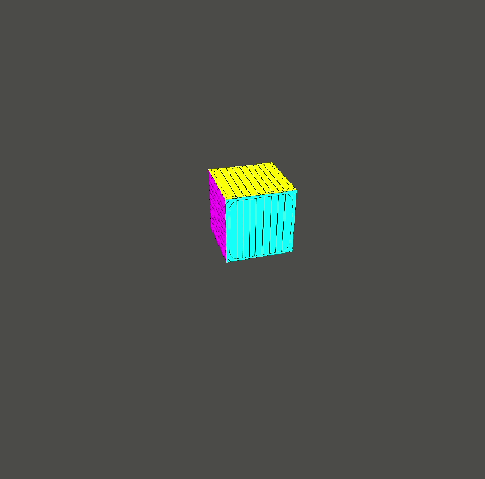

# Textured rotating cube application

The purpose of this application is to play around with textured object. In this case with a textured cube. The application has a camera, so that we can move with the `W`, `A`, `S`, `D`, `Q`, `E` buttons, and the mouse. The cube is rotating on the `Y` axis.

The application could be started with a settings screen, where the color component, position, speed of the items and the background color, and camera parameters could be set.

How to run the application (if you are in the main directory):

- without settings:

```
go run examples/07-textured-rotating-cube/app.go
```



- with settings:

```
SETTINGS=on go run examples/07-textured-rotating-cube/app.go
```

In settings mode, the `escape` key displays the menu screen, where the main screen could be started / continued / restarted with the latest settings. The settings page and exit function also available from the menu screen.
