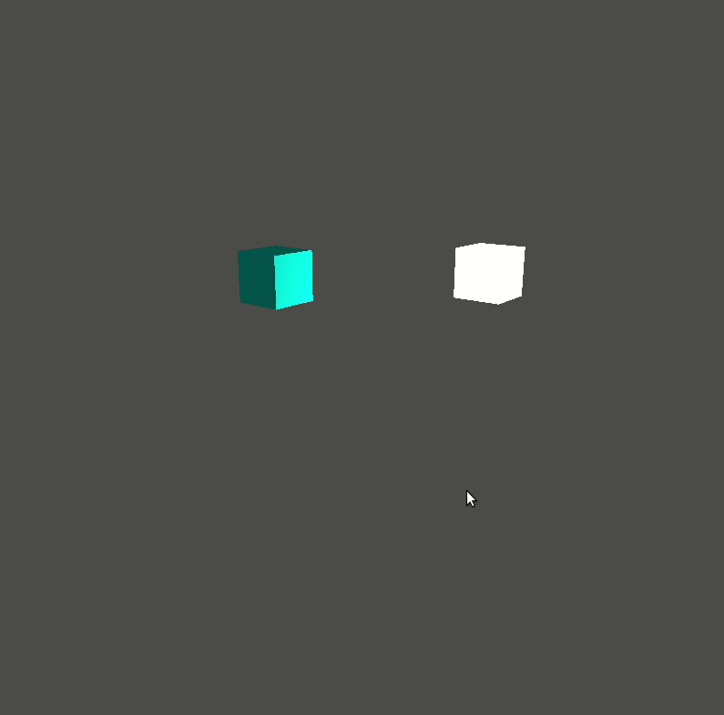

# Colors - cubes, basic lighting

The purpose of this application is the demonstration of the [basic ligthing](https://learnopengl.com/Lighting/Basic-Lighting) tutorial. The application has a camera, so that we can move with the `W`, `A`, `S`, `D`, `Q`, `E` buttons, and the mouse.

The application could be started with a settings screen, where the position, material of the items, the background color, lightsource, and camera parameters could be set.

How to run the application (if you are in the main directory):

- without settings:

```
go run examples/08-basic-lightsource/app.go
```



- with settings:

```
SETTINGS=on go run examples/08-basic-lightsource/app.go
```

In settings mode, the `escape` key displays the menu screen, where the main screen could be started / continued / restarted with the latest settings. The settings page and exit function also available from the menu screen.
