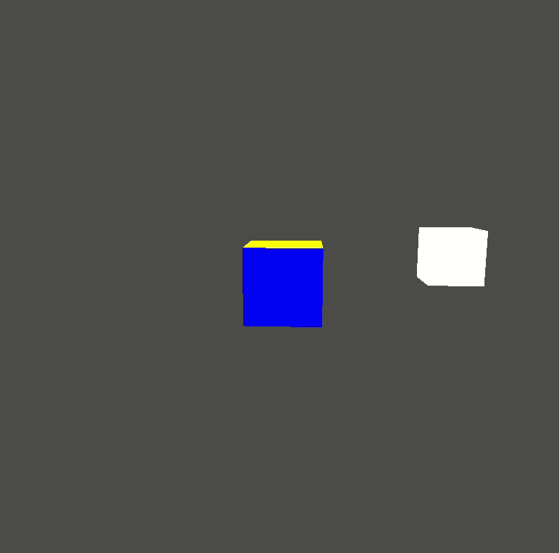

# Colors - cubes with light source

The purpose of this application is the demonstration of the [colors](https://learnopengl.com/Lighting/Colors) tutorial. The application has a camera, so that we can move with the `W`, `A`, `S`, `D`, `Q`, `E` buttons, and the mouse.

