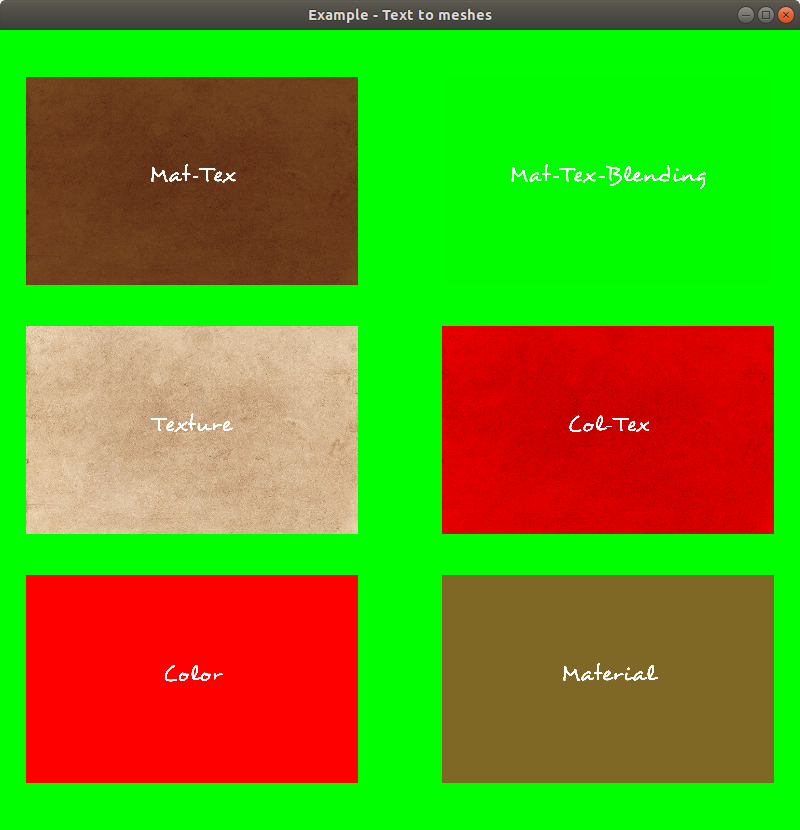

# Text builder application

The purpose of this applciation is to demonstrate how the texts appear in different surfaces. The application displays rectangles with texts, that describes the type of the rectangle mesh. Currently the following meshes are implemented: ColorMesh, MaterialMesh, TexturedMesh, TexturedColorMesh, TexturedMaterialMesh. (PointMesh is skipped from here. It doesn't make sense for me for writing to a point.)
The application does not support the camera movement or rotation.

## How does it look like

```
--------------
|            |
| ----  ---- |
| |  |  |  | |
| ----  ---- |
|            |
| ----  ---- |
| |  |  |  | |
| ----  ---- |
|            |
| ----  ---- |
| |  |  |  | |
| ----  ---- |
|            |
--------------
```

The type of the meshes (order: top left, top right, middle left, middle right, bottom left, bottom right)
- TexturedMaterialMesh without blending
- TexturedMaterialMesh with blending (transparent texture)
- TexturedColorMesh
- TexturedMesh
- ColorMesh
- MaterialMesh

## Camera

The camera is looking to the +X direction. The camera top direction is the -Y. It means the right is the -Z.

## Surface meshes

All the meshes are rectangles (0.8 * 0.5), so that they are  on the X-Z plane, normal points to -Y. With this setup, the rectangles are not facing to the camera, we need to rotate them on the Z axis with -90 deg. Because of the wired orientation of the fonts, we have to apply an other 90 deg rotation on the X axis.

## Preview


